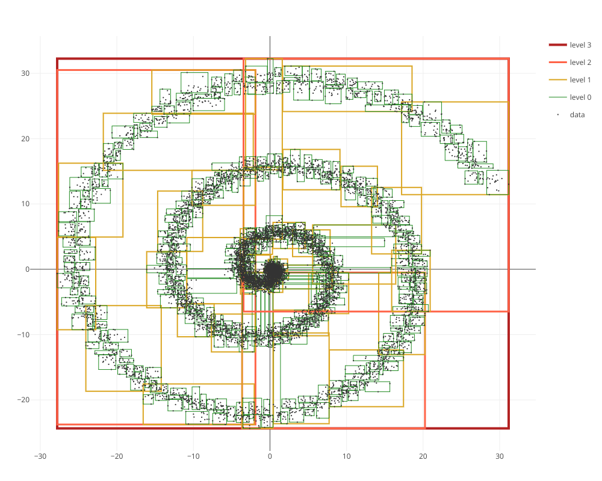

SpatialIndexing.jl
==============

[](https://travis-ci.org/alyst/SpatialIndexing.jl)
[](https://coveralls.io/github/alyst/SpatialIndexing.jl?branch=master)

`SpatialIndexing` package provides the tools for efficient in-memory indexing of
spatial data in Julia (http://julialang.org/).

# Installation
```julia
using Pkg; Pkg.add("https://github.com/alyst/SpatialIndexing.jl")
```
from a Julia REPL.

# Features

## R-tree

[R-tree](https://en.wikipedia.org/wiki/R-tree) organizes the data into
hierarchical structure and ensures that the minimal bounding rectangles (MBRs)
of the nodes (rectangles that encompass all attached data elements) stay compact,
and that the MBRs of the nodes from the same R-tree level have minimal overlap
with each other. The key benefit of R-tree is its ability to rebalance itself
and maintain efficient structure while handling dynamic data (massive insertions
and deletions).

`RTree` implementation supports:
  * different R-tree variants (classic [R-tree](https://en.wikipedia.org/wiki/R-tree),
[R*-tree](https://en.wikipedia.org/wiki/R*_tree), linear and quadratic node splits)
  * `insert!(tree, item)`, `delete!(tree, item)` for element-wise insertion and deletion
  * bulk-loading of data using Overlap-minimizing Top-down (OMT) approach (`load!(tree, data)`)
  * `subtract!(tree, reg)` for removing data within specified region `reg`
  * **TODO: spatial queries**

## Simple Spatial Index

`SimpleSpatialIndex` stores all data elements in a vector. So, while insertion
of new data takes constant time, the time of spatial searches grows linearly
with the number of elements. This spatial index is intended as a reference
implementation for benchmarking and not recommended for production usage.

**TODO**

# Usage

**TODO**

`examples` folder contains `spiral.jl` and `pareto.jl` examples of using R-tree
for storing spatial data.



# See also

Other Julia packages for spatial data:

  * [LibSpatialIndex.jl](https://github.com/yeesian/LibSpatialIndex.jl)
([libspatialindex](https://github.com/libspatialindex/libspatialindex) wrapper)
  * [NearestNeighbors.jl](https://github.com/KristofferC/NearestNeighbors.jl)
  * [RegionTrees.jl](https://github.com/rdeits/RegionTrees.jl)
  * [LSH.jl](https://github.com/Keno/LSH.jl)

# References

* A.Guttman, _“R-Trees: A Dynamic Index Structure for Spatial Searching”_
  Proc. 1984 ACM-SIGMOD Conference on Management of Data (1985), pp.47-57.
* N. Beckmann, H.P. Kriegel, R. Schneider, B. Seeger,
  _"The R*-tree: an efficient and robust access method for points and rectangles"_
  Proc. 1990 ACM SIGMOD international conference on Management of data (1990), p.322
* T. Lee and S. Lee, _"OMT: Overlap Minimizing Top-down Bulk Loading Algorithm for R-tree"_,
  CAiSE Short Paper Proceedings (2003) [paper](http://ceur-ws.org/Vol-74/files/FORUM_18.pdf)
